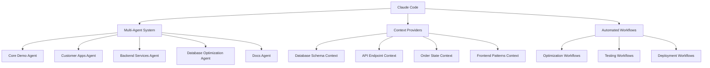
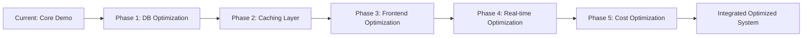

# RideNDine Optimization System for Claude Code

**Status:** Active System
**Version:** 1.0
**Date:** 2026-01-31
**Integration:** Claude Code + Multi-Agent Architecture

---

## Overview

This document defines a comprehensive optimization system for RideNDine that leverages:
- **Claude Code's multi-agent architecture** (from AGENTS.md)
- **Database optimization strategies** (Phase 1-5 from MULTI_AGENT_OPTIMIZATION_PLAN.md)
- **Context-aware development workflows** (adapted from COPILOT_OPTIMIZATION_PLAN.md)

---

## System Architecture



---

## Part 1: Agent Definitions (from AGENTS.md)

### Current Agent Structure

| Agent | Scope | Status | Priority |
|-------|-------|--------|----------|
| **Core Demo Agent** | `ridendine_v2_live_routing/` | Working | Maintain |
| **Customer Apps Agent** | `apps/customer-{web,mobile}` | Working | Enhance |
| **Backend Services Agent** | `services/` | Scaffolds | Integrate |
| **Database Agent** | `database/` | Empty → Optimized | **Phase 1 Active** |
| **Docs Agent** | `*.md` files | Mixed | Update |

### New Optimization Agents

| Agent | Purpose | Implementation |
|-------|---------|----------------|
| **Database Optimization Agent** | Phase 1-5 optimizations | In Progress (Phase 1 complete) |
| **Cache Optimization Agent** | Redis integration (Phase 2) | Planned |
| **Frontend Performance Agent** | Bundle + WebSocket optimization | Planned |
| **Real-time Optimization Agent** | Delta updates + compression | Planned |
| **Cost Optimization Agent** | Resource monitoring + reduction | Planned |

---

## Part 2: Context Providers (Claude Code Adaptation)

### 1. Database Schema Context

**Purpose:** Provide intelligent database query and schema assistance

**Capabilities:**
- Understand current schema from migrations (001-009)
- Suggest optimal indexes for new queries
- Validate schema changes
- Generate migration scripts
- Performance impact analysis

**Usage:**
```
User: "Add a new column to orders table for estimated_prep_time"

Claude Code will:
1. Read current schema from migrations
2. Suggest appropriate data type
3. Check for index needs
4. Generate migration with rollback
5. Update related code (orders.service.ts)
```

**Files Monitored:**
- `database/migrations/*.sql`
- `services/api/src/**/*.service.ts`
- `database/PHASE1_IMPLEMENTATION_GUIDE.md`

---

### 2. API Endpoint Context

**Purpose:** Provide intelligent API development assistance

**Capabilities:**
- List all NestJS endpoints
- Understand request/response schemas
- Generate curl commands
- Validate DTOs
- Security analysis (auth guards, validation)

**Usage:**
```
User: "Create endpoint for chef payout requests"

Claude Code will:
1. Scan existing endpoints in services/api/src/
2. Generate controller + service + DTO
3. Add proper guards (ChefGuard, JwtAuthGuard)
4. Include validation decorators
5. Add tests
```

**Files Monitored:**
- `services/api/src/**/*.controller.ts`
- `services/api/src/**/*.dto.ts`
- `services/api/src/**/*.service.ts`

---

### 3. Order State Machine Context

**Purpose:** Ensure order state transitions follow business rules

**Capabilities:**
- Validate state transitions
- Generate state transition diagrams
- Check refund requirements
- Audit logging compliance

**Usage:**
```
User: "Add new state 'quality_check' between 'preparing' and 'ready'"

Claude Code will:
1. Read OrderStateMachine in orders/orders.service.ts
2. Validate transition logic
3. Update state machine
4. Add to order_status_history enum
5. Update UI components
```

**Files Monitored:**
- `services/api/src/orders/orders.service.ts` (OrderStateMachine)
- `database/migrations/*.sql` (order_status enum)
- `apps/customer-mobile/src/components/order/OrderStatusTimeline.tsx`

---

### 4. Frontend Patterns Context

**Purpose:** Maintain consistent React Native component patterns

**Capabilities:**
- Understand existing component structure
- Generate new components matching patterns
- Navigation structure awareness
- State management patterns (Zustand)

**Usage:**
```
User: "Create a DriverCard component like ChefCard"

Claude Code will:
1. Read ChefCard component structure
2. Generate DriverCard with same patterns
3. Match styling conventions (colors, spacing)
4. Include TypeScript interfaces
5. Add to component exports
```

**Files Monitored:**
- `apps/customer-mobile/src/components/**/*.tsx`
- `apps/customer-mobile/src/store/**/*.ts`
- `apps/customer-mobile/src/navigation/types.ts`

---

## Part 3: Automated Workflows

### Workflow 1: Database Migration

**Command:** `/rnd-migrate [description]`

**Steps:**
1. Prompt for migration details
2. Check migration number (next available)
3. Generate migration SQL with:
   - Transaction blocks
   - Indexes for new columns
   - Rollback commands
   - Performance considerations
4. Update PHASE1_IMPLEMENTATION_GUIDE.md
5. Prompt to run migration

**Example:**
```bash
/rnd-migrate "Add driver ratings aggregation"

# Generates:
# database/migrations/010_add_driver_ratings.sql
# Updates documentation
# Provides psql command to apply
```

---

### Workflow 2: API Endpoint Generation

**Command:** `/rnd-endpoint [method] [path] [description]`

**Steps:**
1. Parse method (GET/POST/PUT/DELETE) and path
2. Determine module (orders, users, chefs, etc.)
3. Generate:
   - Controller method with route decorator
   - Service method with business logic
   - DTO with validation decorators
   - Test spec
4. Add to module if needed
5. Update API documentation

**Example:**
```bash
/rnd-endpoint POST /api/chefs/:id/payout-request "Create chef payout request"

# Generates:
# services/api/src/chefs/chefs.controller.ts (new method)
# services/api/src/chefs/dto/payout-request.dto.ts
# services/api/src/chefs/chefs.service.ts (new method)
# services/api/src/chefs/chefs.controller.spec.ts
```

---

### Workflow 3: React Native Component

**Command:** `/rnd-component [type] [name]`

**Types:** `ui`, `feature`, `screen`

**Steps:**
1. Choose template based on type
2. Generate component with:
   - TypeScript interfaces
   - StyleSheet (matching design system)
   - Props with defaults
   - Accessibility props
3. Create component file
4. Update index exports

**Example:**
```bash
/rnd-component feature DriverCard

# Generates:
# apps/customer-mobile/src/components/driver/DriverCard.tsx
# Updates apps/customer-mobile/src/components/driver/index.ts
```

---

### Workflow 4: Performance Testing

**Command:** `/rnd-test [scope]`

**Scopes:** `database`, `api`, `frontend`, `e2e`, `all`

**Steps:**
1. Run appropriate benchmark script
2. Compare against targets
3. Generate performance report
4. Suggest optimizations if targets not met

**Example:**
```bash
/rnd-test database

# Runs:
# npx ts-node database/scripts/benchmark_performance.ts
# Shows results vs targets
# Suggests next optimizations
```

---

### Workflow 5: Deploy Optimization Phase

**Command:** `/rnd-deploy phase[1-5]`

**Steps:**
1. Validate prerequisites
2. Run migrations
3. Restart services
4. Run benchmarks
5. Generate deployment report

**Example:**
```bash
/rnd-deploy phase1

# Executes:
# 1. Start database
# 2. Apply migrations 008-009
# 3. Restart API service
# 4. Run performance benchmarks
# 5. Show results
```

---

## Part 4: Optimization Phases (from MULTI_AGENT_OPTIMIZATION_PLAN.md)

### Phase 1: Database Optimizations ✅ CODE COMPLETE

**Status:** Ready for deployment
**Expected Improvement:** 2-10x faster queries

**Components:**
- ✅ PostGIS spatial indexes (migration 008)
- ✅ Composite indexes (migration 009)
- ✅ Connection pool optimization
- ✅ Batch insert optimization
- ✅ Performance testing suite

**Deploy:** `/rnd-deploy phase1`

---

### Phase 2: Caching Layer 📋 PLANNED

**Status:** Design phase
**Expected Improvement:** 5-40x faster reads

**Components:**
- Redis integration
- Chef menu caching (12-hour TTL)
- Location-based query caching (1-minute TTL)
- Stripe customer ID caching
- Cache invalidation strategies

**Start:** After Phase 1 validation

---

### Phase 3: Frontend Optimization 📋 PLANNED

**Status:** Design phase
**Expected Improvement:** 100% reduction in polling

**Components:**
- WebSocket-only architecture
- Session resumption
- Bundle size optimization
- Lazy loading
- Optimistic UI updates

---

### Phase 4: Real-time Optimization 📋 PLANNED

**Status:** Design phase
**Expected Improvement:** 95% bandwidth reduction

**Components:**
- Delta update system
- Message compression
- Redis pub/sub for multi-server
- Selective broadcasting

---

### Phase 5: Cost Optimization 📋 PLANNED

**Status:** Design phase
**Expected Improvement:** 50% cost reduction

**Components:**
- Query cost tracking
- Request deduplication
- Resource monitoring
- Auto-scaling triggers

---

## Part 5: Integration with Existing System

### Integration Points

| Existing Component | Optimization Integration |
|-------------------|-------------------------|
| **Core Demo Server** | Phase 4 (real-time optimization) |
| **Customer Mobile App** | Phase 3 (frontend optimization) |
| **NestJS API Service** | Phase 1 (database) + Phase 2 (caching) |
| **Database (Empty)** | Phase 1 (spatial indexes, composite indexes) |
| **Dispatch Service** | Phase 1 (spatial queries) |

### Migration Path



---

## Part 6: Context-Aware Development Prompts

### Backend Development

**When creating API endpoints:**
```
1. Check existing patterns in services/api/src/
2. Follow NestJS module structure
3. Add validation with class-validator decorators
4. Include proper guards (JwtAuthGuard, RoleGuard)
5. Add tests with Jest
6. Update API documentation
```

**When modifying database:**
```
1. Create migration in database/migrations/
2. Use CONCURRENTLY for index creation
3. Include rollback commands
4. Test on development database
5. Update Phase 1 documentation
```

**When changing order states:**
```
1. Validate with OrderStateMachine.canTransition()
2. Check requiresRefund() for refund logic
3. Update order_status_history table
4. Emit WebSocket events
5. Handle Stripe refunds if needed
```

---

### Frontend Development

**When creating React Native components:**
```
1. Match existing component structure
2. Use TypeScript with proper interfaces
3. Follow design system (colors: #ff9800, #151515, #f7f4ee)
4. Include accessibility props
5. Add loading and error states
6. Test on iOS and Android
```

**When managing state:**
```
1. Use Zustand for global state (see src/store/)
2. Use React Context for component-level state
3. Implement proper TypeScript types
4. Add persistence for critical state (SecureStore)
```

**When adding navigation:**
```
1. Update types in src/navigation/types.ts
2. Add screen to appropriate navigator
3. Implement deep linking support
4. Update navigation flow documentation
```

---

## Part 7: Quick Reference Commands

### Database Commands

```bash
# Check database status
/rnd-status database

# Run specific migration
/rnd-migrate-run 008

# Rollback migration
/rnd-migrate-rollback 008

# Show schema for table
/rnd-schema orders

# Generate SQL query
/rnd-query "find all pending orders from last week"
```

---

### API Commands

```bash
# List all endpoints
/rnd-endpoints

# Show endpoint details
/rnd-endpoint-info POST /api/orders

# Generate curl command
/rnd-curl POST /api/orders

# Validate request payload
/rnd-validate-payload orders/create-order.dto
```

---

### Testing Commands

```bash
# Run all tests
/rnd-test all

# Run specific test suite
/rnd-test api
/rnd-test database
/rnd-test frontend

# Run benchmarks
/rnd-benchmark database

# Generate performance report
/rnd-report performance
```

---

### Deployment Commands

```bash
# Deploy optimization phase
/rnd-deploy phase1
/rnd-deploy phase2

# Check deployment status
/rnd-status deployment

# Rollback optimization
/rnd-rollback phase1

# Validate deployment
/rnd-validate deployment
```

---

## Part 8: Monitoring and Metrics

### Performance Targets

| Metric | Current | Phase 1 Target | Phase 2 Target | Phase 5 Target |
|--------|---------|---------------|---------------|---------------|
| Driver dispatch | 100-200ms | 10-20ms | 2-5ms (cached) | 2-5ms |
| Chef search | 80-120ms | 15-30ms | 2ms (cached) | 2ms |
| Order creation | 50-150ms | 25-75ms | 25-75ms | 20-60ms |
| API response | 40-60ms | 20-40ms | 2-10ms (cached) | 2-10ms |
| WebSocket bandwidth | 100KB/5s | 100KB/5s | 100KB/5s | 2-5KB/5s |
| Monthly cloud cost | $620 | $620 | $550 | $310 |

### Monitoring Commands

```bash
# Check current metrics
/rnd-metrics

# Show slow queries
/rnd-slow-queries

# Connection pool status
/rnd-pool-status

# Cache hit rate
/rnd-cache-stats

# Cost analysis
/rnd-cost-analysis
```

---

## Part 9: Usage Examples

### Example 1: Creating New API Endpoint

**User prompt:**
```
Create endpoint for chef to request payout of their earnings
```

**Claude Code workflow:**
1. Analyzes existing payout structure
2. Checks chef_ledger table schema
3. Generates:
   - `PayoutRequestDto` with validation
   - Controller method with `@ChefGuard()`
   - Service method with Stripe Connect logic
   - Tests for happy path + edge cases
4. Shows code preview
5. Asks for approval to create files

---

### Example 2: Optimizing Slow Query

**User prompt:**
```
The chef dashboard is slow when loading orders
```

**Claude Code workflow:**
1. Reads orders.service.ts listOrders method
2. Analyzes query pattern
3. Checks existing indexes (from Phase 1)
4. Suggests:
   - Add composite index (chef_id, created_at)
   - Use INCLUDE for commonly fetched columns
   - Implement result caching (Phase 2)
5. Generates migration
6. Updates code with optimized query

---

### Example 3: Adding New Order State

**User prompt:**
```
Add "quality_check" state between "preparing" and "ready"
```

**Claude Code workflow:**
1. Reads OrderStateMachine logic
2. Validates transition rules
3. Generates:
   - Migration to add enum value
   - Update to OrderStateMachine.canTransition()
   - UI component update (OrderStatusTimeline)
   - WebSocket event handler
4. Shows impact analysis
5. Creates implementation plan

---

## Part 10: Maintenance and Updates

### Weekly Tasks

```bash
# Update MCP data (if using external systems)
/rnd-update-context

# Regenerate API documentation
/rnd-docs-generate

# Run performance regression tests
/rnd-test regression

# Update optimization metrics
/rnd-metrics-update
```

### Monthly Tasks

```bash
# Review optimization gains
/rnd-report monthly

# Analyze cost trends
/rnd-cost-trend

# Update documentation
/rnd-docs-sync

# Plan next optimization phase
/rnd-plan-next
```

---

## Part 11: Integration Checklist

### Phase 1 Deployment Checklist

- [ ] Database running (Docker or system PostgreSQL)
- [ ] PostGIS extension available
- [ ] Migration 008 (spatial indexes) applied
- [ ] Migration 009 (composite indexes) applied
- [ ] API service restarted
- [ ] Benchmarks run successfully
- [ ] All targets met (10x improvement verified)
- [ ] Documentation updated
- [ ] Team notified

### Phase 2 Preparation Checklist

- [ ] Phase 1 validated for 24+ hours
- [ ] Redis instance available
- [ ] Cache strategy documented
- [ ] Invalidation logic designed
- [ ] Performance targets defined
- [ ] Rollback plan created

---

## Summary

This RideNDine Optimization System provides:

1. **Agent-based architecture** aligned with AGENTS.md
2. **Context-aware development** using Claude Code capabilities
3. **Automated workflows** for common tasks
4. **5-phase optimization roadmap** with clear targets
5. **Integration points** with existing system
6. **Performance monitoring** and validation

**Current Status:**
- ✅ Phase 1: Database Optimizations (CODE COMPLETE)
- 📋 Phase 2-5: Design phase
- 🚀 Ready for deployment

**Next Steps:**
1. Deploy Phase 1 optimizations (`/rnd-deploy phase1`)
2. Validate 10x performance improvements
3. Begin Phase 2 design (Redis caching)

---

**System Version:** 1.0
**Last Updated:** 2026-01-31
**Maintained By:** Multi-Agent Optimization Team
